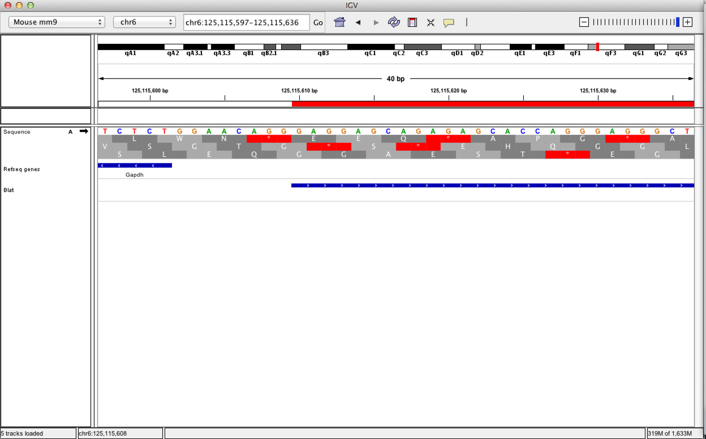
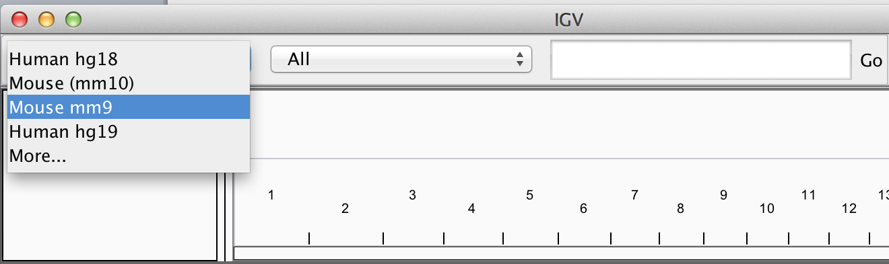
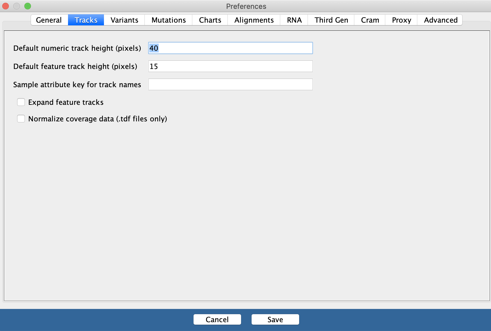
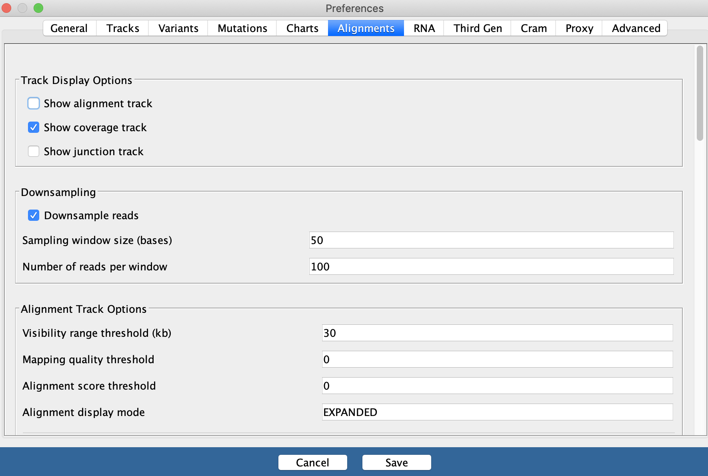

## Overview

- Introduction to IGV.
    - What is IGV.
    - How to run IGV.
- Navigating IGV.
    - The IGV user interface.
    - Moving around genomes.
- Loading and visualising data.
    - Genome information and annotation.
    - User supplied data.
    - Sample information.
    - External data.
- Displaying genomics data
    - Basic visualisation.
    - Data dependent visualisation.

---
## What is IGV?

- Created by the Broad institute.
- Genome browser.
    - Visualises genomic data (expression, ChIP, resequencing, multiple alignment, shRNA)
    - Handles most common genomic data types.
Java Desktop application
    - No dependence on server
    - Loads data locally or from URL, consumes memory and CPU.

---
## How to run IGV?

- Requires Java
- IGV available from Broad

http://www.broadinstitute.org/software/igv/download

---
## How to run IGV? (Binary version)

- Download to computer.
- Runs locally.
- Archived versions available

---
## How to run IGV? (Webstart)

- Runs from webstart.
- Always runs latest version of IGV

---
## IGV GUI

---
## IGV GUI

.pull-left[

]
.pull-right[
- Sample information panel <1>
- Genome Navigation panel <2>
- Data panel <3>
- Attribute panel <4>
]
---
## Menu bar

- File - Load data/sample information.
- Genome - Load and manage genomes.
- View -  Display preferences.
- Tracks - Group/sort/filter data tracks.
- Regions - Create region/gene lists.
- Tools -  Access to Integrated tools (IGVtools/Bedtools).
- GenomeSpace - Export/import from Genomespace

---
## Moving around genomes
- Cytoband selection and zooming
- Scrolling
- Selection of region of interest

---
## Moving around genomes

---
## Zoom

.pull-left[

]
.pull-right[

]
---

## Scrolling

---

## Jump to region.

.pull-left[

]
.pull-right[

]

---

## “Bookmarking” regions of interest

- Regions may be added to “Regions of interest”
 
- These act as bookmarks for areas of particular interest
 
- Bookmarks can be added by -
    - Bookmarking visible window
    - Selecting region within window

---

## Bookmarking - Visible window

.pull-left[

]
.pull-right[

]

---

## Bookmarking

---

## Bookmarking

- Bookmarks may be created from selecting "region of interest" button and edge of region

---

## Sequences from regions of interest
- A useful feature of "regions of interest" is to retrieve of BLAT sequences.

---

## Sequences from regions of interest
- BLAT results present as table of hits.

---

## Viewing sequences

- At a predefined resolution, sequence information becomes available.

---

## Viewing sequences

- Strand of sequence can be altered.
- Differing translation tables can be selected

---

## Sequences from regions of interest
- A useful feature of "regions of interest" is to retrieve of BLAT sequences.

---
class: inverse, center, middle

# Loading data in IGV

<html>

</html> 

---
## Loading Genome Information

- Most genomes can be selected from dropdown.

.pull-left[

]
.pull-right[

]

---
## Loading Genome Information

.pull-left[
- Genomes not included may be downloaded from repository
]

.pull-right[

]

---

## Loading Genome Information

- For supported genomes, gene positions are automatically included in “feature” panel.
- Additional gene positions can be loaded into IGV in gff format

---
## Loading Sample data
- Most common formats can be loaded into IGV through file menu
- Acceptable data formats include:-
    - BED (.bed)
    - BAM and index (.bam with .bai/.bam.bai)
    - BigWig (.bw)
    - BedGraph/Wig (.bedGraph, .wig)
    - And many more..
    
- **link to IGV formats.**

---
## Loading Sample Metadata

.pull-left[
- IGV allows the inclusion of information on samples.
- Sample information is included in sample information panel.
]
.pull-right[

]
---
## Loading Sample Metadata

Example Sample information file
http://www.broadinstitute.org/igvdata/exampleFiles/exampleSampleInfo.txt

---
## Sample Metadata with TrackTables

- Tracktables R/Bioconductor packages
- Creates HTML reports with sample information for use with IGV.

---
## Using sample information.

- Sample information can include discrete and continuous.
 
    - Can be used to “sort” and “filter” tracks.
 
    - Can split tracks across panels by “group”

---
## Loading Genome Information

.pull-left[

]
.pull-right[

]

---
## Loading external data and annotation
 ** Load data from a URL ** 
- As with UCSC, IGV supports data hosted on external servers.
- Data accessible from a URL such as HTTP and FTP can be loaded using the “Load from URL”.

---
## Load data from a URL

.pull-top[

]
.pull-bottom[

]

---
## Loading external data and annotation
** Load data from a server (IGV/Encode servers).** 

- Unlike UCSC, IGV comes with few external tracks.
 
 
- External tracks (relevant to the genome) can be loaded from the IGV server or Encode-IGV server.

---
## Load data from a server (IGV/Encode)

---
## Grabbing encode data directly
- Encode data can be downloaded from UCSC.
    - http://genome.ucsc.edu/ENCODE/

- This however does not come with sample information provided through IGV interface

---
class: inverse, center, middle

# Viewing Data

<html>

</html> 

---
## Viewing data

- IGV associates common file formats with default display methods.
 
- Most of the time IGV will make a sensible choice how we wish to display data.

---
## Accepted formats and default display.

- Information on accepted file formats and default display can be found at -

 http://www.broadinstitute.org/software/igv/RecommendedFileFormats
 
 

---
## Bed/bigBed

.pull-left[
- Basic
- Tab-delimited
- Chrom,Start,End
- Bed6
- bigBed (recommended)
]
.pull-right[
 

]
---
## Wig, BedGraph and BigWig

.pull-left[
- Wig/bedGraph require high memory load
- Recommended format is bigWig
]
.pull-right[
 

]
---
## BAM alignment files
.pull-left[
- BAM files contain alignment information.
- Require an accompanying .bai index file for display
]
.pull-right[
 

]

---
## Finer control of display

- IGV allows for customization of track display.
 
- Menu bar -> View -> Preferences
 
- Select track (right click)

---
## Display preferences

** General **

 

---
## Display preferences

** Tracks **

 

---
## Display preferences

** Alignments **

 

---
## Track display options

** Graph/interval files**
- Track colour/appearance

 

---
## Track display options

** Graph/interval files**
- Graph type

 

---
## Track display options
**Data Scaling.**

 

---
## Track display options

- Autoscaling adjusts to track's visible signal maximum

 

---
class: inverse, center, middle

# Some more useful IGV features

<html>

</html> 

---

## IGV displays splicing.

 

---
## IGV's Sashimi plots

(http://www.broadinstitute.org/igv/Sashimi)

 

---
## IGV - Overlay tracks

 

---
## Overlay tracks

 

---
## Track summarisation.

IGV can be used to combine tracks

 

---
## Sum of two tracks

 

---
## Create new summed track

 

---
## IGVtools
- IGVTools can be used to post-process genomics data.
- Includes indexing, sorting and genome graph creation.
.pull-left[

]
.pull-right[

]
---
## Where to get help?

- http://www.broadinstitute.org/igv/UserGuide
 
- https://groups.google.com/forum/#!forum/igv-help

